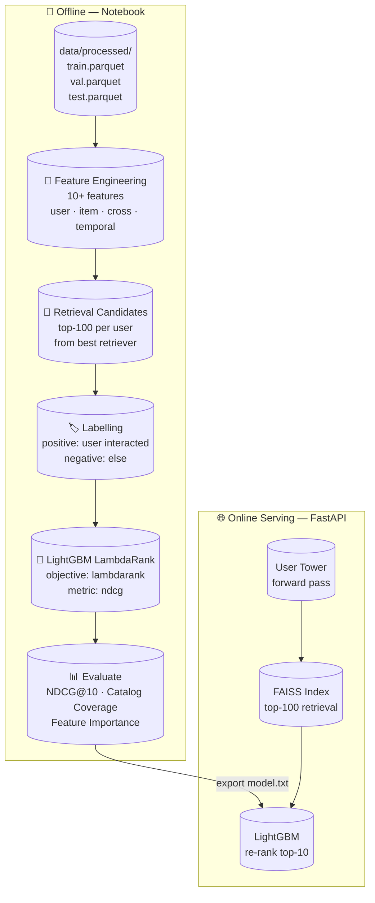
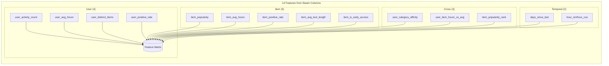

# Task 4 — Ranking (Feature Engineering + LightGBM LambdaRank)

> **For Hermes:** Use this plan as implementation guide for task4-ranking-lightgbm branch.
>
> Branch: `task4-ranking-lightgbm` (from `dev`)
>
> **Goal:** Build a LightGBM LambdaRank reranker on top of retrieval candidates,
> with 10+ engineered features, evaluated NDCG@10 and Catalog Coverage.
>
> **Architecture:** Feature engineering pipeline (user/item/cross/temporal features)
> → LightGBM LambdaRank training on positive/negative candidates
> → model export → integration into FastAPI serving pipeline.
>
> **Tech Stack:** Python 3.14, PyTorch (ROCm 7.1), LightGBM, pandas, numpy, FAISS,
> scikit-learn, uv (package manager)

---

## Mermaid: Ranking Pipeline in Context





---

## Prérequis: Environment Setup

### Step 0: Create venv + install all deps

```bash
cd /home/malo/Documents/ais3/resystem/steam-recsys-pipeline

# Create venv with Python 3.14
uv venv --python 3.14
source .venv/bin/activate

# PyTorch with ROCm backend (RX 6900 XT = gfx1030, ROCm 7.1)
uv pip install torch torchvision torchaudio \
  --index-url https://download.pytorch.org/whl/rocm7.1

# Core data science
uv pip install pandas numpy matplotlib seaborn pyarrow jupyter

# Ranking
uv pip install lightgbm scikit-learn

# Verify GPU
python -c "
import torch
print(f'PyTorch {torch.__version__}')
print(f'ROCm available: {torch.cuda.is_available()}')
print(f'GPU: {torch.cuda.get_device_name(0)}')
x = torch.randn(1000,1000, device='cuda')
print('GPU compute OK')
"
```

---

## Implementation Plan

### Task 1: Create ranking module scaffolding

**Objective:** Set up the Python module structure for reusable ranking code.

**Files:**
- Create: `src/steam_recsys/ranking/__init__.py`
- Create: `src/steam_recsys/ranking/features.py` — feature engineering
- Create: `src/steam_recsys/ranking/train.py` — LightGBM training + evaluation

```python
# src/steam_recsys/ranking/__init__.py
"""Ranking module: feature engineering + LightGBM LambdaRank reranker."""
```

---

### Task 2: Feature Engineering — User-level features

**Objective:** Compute 4 user-level features from training interactions.

**Files:**
- Create: `src/steam_recsys/ranking/features.py`

**Features to implement:**

| # | Feature | Description | Compute from |
|---|---------|-------------|-------------|
| 1 | `user_activity_count` | Number of interactions | `interactions.groupby('user_id').size()` |
| 2 | `user_avg_hours` | Mean playtime | `interactions.groupby('user_id')['hours'].mean()` |
| 3 | `user_distinct_items` | Unique games played | `interactions.groupby('user_id')['item_id'].nunique()` |
| 4 | `user_positive_rate` | Fraction of positive (≥1h) interactions | `interactions.groupby('user_id')['is_positive'].mean()` |

```python
# src/steam_recsys/ranking/features.py
"""Feature engineering for LightGBM LambdaRank reranker.

All features are computed from training data only to avoid leakage.
"""

from __future__ import annotations

import pandas as pd


def compute_user_features(interactions: pd.DataFrame) -> pd.DataFrame:
    """Compute per-user aggregate features from training interactions."""
    user = interactions.groupby("user_id").agg(
        user_activity_count=("item_id", "count"),
        user_avg_hours=("hours", "mean"),
        user_distinct_items=("item_id", "nunique"),
        user_positive_rate=("is_positive", "mean"),
        user_total_hours=("hours", "sum"),
    ).reset_index()
    return user
```

---

### Task 3: Feature Engineering — Item-level features

**Objective:** Compute 4 item-level features.

**Features:**

| # | Feature | Description |
|---|---------|-------------|
| 5 | `item_popularity` | Interaction count per item |
| 6 | `item_avg_hours` | Mean playtime per item |
| 7 | `item_positive_rate` | Fraction of positive interactions per item |
| 8 | `item_category` | Genre/category (one-hot encoded later) |

```python
def compute_item_features(interactions: pd.DataFrame,
                          catalog: pd.DataFrame) -> pd.DataFrame:
    """Compute per-item aggregate features."""
    item = interactions.groupby("item_id").agg(
        item_popularity=("user_id", "count"),
        item_avg_hours=("hours", "mean"),
        item_positive_rate=("is_positive", "mean"),
    ).reset_index()

    # Merge catalog metadata (category)
    item = item.merge(
        catalog[["item_id", "category"]], on="item_id", how="left"
    )
    return item
```

---

### Task 4: Feature Engineering — Cross-features + Temporal features

**Objective:** Compute cross-features and temporal features.

**Features:**

| # | Feature | Description |
|---|---------|-------------|
| 9 | `user_item_category_affinity` | % of user's interactions in this item's category |
| 10 | `user_item_hours_ratio` | This item's playtime / user's avg |
| 11 | `days_since_last_interaction` | Days between candidate time and user's last interaction |
| 12 | `recency_weight` | Exponential decay: exp(-days / 30) |
| 13 | `hour_of_day` | Hour of the event (sin/cos encoded) |

```python
def compute_cross_features(candidates: pd.DataFrame,
                           user_features: pd.DataFrame,
                           item_features: pd.DataFrame,
                           interactions: pd.DataFrame) -> pd.DataFrame:
    """Merge user/item features and compute cross-features."""
    df = candidates.merge(user_features, on="user_id", how="left")
    df = df.merge(item_features, on="item_id", how="left")

    # Category affinity: % of user games in this category
    user_cat = (
        interactions.merge(
            item_features[["item_id", "category"]], on="item_id"
        )
        .groupby(["user_id", "category"])
        .size()
        .reset_index(name="cat_count")
    )
    user_total = interactions.groupby("user_id").size().reset_index(name="total")
    user_cat = user_cat.merge(user_total, on="user_id")
    user_cat["user_item_category_affinity"] = user_cat["cat_count"] / user_cat["total"]

    df = df.merge(
        user_cat[["user_id", "category", "user_item_category_affinity"]],
        on=["user_id", "category"], how="left"
    )
    df["user_item_category_affinity"] = df["user_item_category_affinity"].fillna(0)

    # Playtime ratio
    df["user_item_hours_ratio"] = (
        df.get("hours", 0) / df["user_avg_hours"].replace(0, 1)
    )

    return df


def compute_temporal_features(candidates: pd.DataFrame,
                              interactions: pd.DataFrame) -> pd.DataFrame:
    """Compute recency and temporal features."""
    # Last interaction time per user (from training)
    last_interaction = (
        interactions.groupby("user_id")["event_time"].max().reset_index()
    )
    last_interaction.columns = ["user_id", "last_event_time"]

    df = candidates.merge(last_interaction, on="user_id", how="left")
    df["days_since_last"] = (
        (df["event_time"] - df["last_event_time"]).dt.total_seconds() / 86400
    ).fillna(365).clip(0, 365)
    df["recency_weight"] = (-df["days_since_last"] / 30).clip(-12, 0).exp()

    # Hour of day (cyclic encoding — sin/cos pair)
    hour = df["event_time"].dt.hour.fillna(0)
    df["hour_sin"] = (2 * 3.14159 * hour / 24).sin()
    df["hour_cos"] = (2 * 3.14159 * hour / 24).cos()

    return df
```

---

### Task 5: Main feature pipeline — `build_features()`

**Objective:** Single function that orchestrates all feature computation.

```python
def build_features(candidates: pd.DataFrame,
                   train_interactions: pd.DataFrame,
                   catalog: pd.DataFrame) -> tuple[pd.DataFrame, list[str]]:
    """Compute all features for ranking candidates.

    Args:
        candidates: DataFrame with [user_id, item_id, event_time, hours]
        train_interactions: Full training set (no leakage from val/test)
        catalog: Item metadata

    Returns:
        (feature_matrix, feature_names) — ready for LightGBM
    """
    user_feat = compute_user_features(train_interactions)
    item_feat = compute_item_features(train_interactions, catalog)

    df = compute_cross_features(candidates, user_feat, item_feat, train_interactions)
    df = compute_temporal_features(df, train_interactions)

    # One-hot encode category
    df = pd.get_dummies(df, columns=["category"], prefix="cat")

    # Define feature columns (exclude identifiers and targets)
    exclude = {"user_id", "item_id", "event_time", "hours",
               "is_positive", "last_event_time", "category"}
    feature_cols = [c for c in df.columns if c not in exclude]

    return df, feature_cols
```

---

### Task 6: LightGBM LambdaRank training

**Objective:** Train LambdaRank model on retrieval candidates.

**Files:**
- Create: `src/steam_recsys/ranking/train.py`

```python
"""LightGBM LambdaRank training and evaluation."""

from __future__ import annotations

import lightgbm as lgb
import numpy as np
import pandas as pd
from sklearn.metrics import ndcg_score


def prepare_ranking_data(feature_df: pd.DataFrame,
                         feature_cols: list[str],
                         group_col: str = "user_id") -> tuple:
    """Convert feature matrix to LightGBM Dataset with query groups."""
    # Sort by user for group-based ranking
    df = feature_df.sort_values(group_col).reset_index(drop=True)

    X = df[feature_cols].values
    y = df["is_positive"].astype(float).values

    # Build query groups (rows per user)
    query_sizes = df.groupby(group_col, sort=False).size().values

    return X, y, query_sizes


def train_ranker(X_train, y_train, query_train,
                 X_val, y_val, query_val,
                 feature_names: list[str]) -> lgb.Booster:
    """Train LightGBM LambdaRank model."""
    params = {
        "objective": "lambdarank",
        "metric": "ndcg",
        "ndcg_eval_at": [10],
        "boosting_type": "gbdt",
        "num_leaves": 128,
        "learning_rate": 0.05,
        "feature_fraction": 0.8,
        "min_data_in_leaf": 50,
        "verbose": -1,
        "seed": 42,
    }

    train_data = lgb.Dataset(
        X_train, label=y_train, group=query_train,
        feature_name=feature_names
    )
    val_data = lgb.Dataset(
        X_val, label=y_val, group=query_val,
        feature_name=feature_names, reference=train_data
    )

    model = lgb.train(
        params,
        train_data,
        valid_sets=[val_data],
        num_boost_round=500,
        callbacks=[
            lgb.early_stopping(stopping_rounds=30),
            lgb.log_evaluation(period=50),
        ],
    )
    return model


def evaluate_ranker(model: lgb.Booster,
                    X_test, y_test, query_test,
                    catalog_size: int) -> dict:
    """Compute NDCG@10 and Catalog Coverage."""
    scores = model.predict(X_test)

    # Reshape per query group for NDCG calculation
    results = {"ndcg_10": [], "recommended_items": set()}
    start = 0
    for qsize in query_test:
        end = start + qsize
        group_y = y_test[start:end]
        group_scores = scores[start:end]

        if group_y.sum() > 0 and len(group_y) >= 10:
            # Get top-10 indices for this user
            top_idx = np.argsort(group_scores)[::-1][:10]
            retrieved = set(top_idx)
            relevant = set(np.where(group_y > 0)[0])

            # Catalog coverage: track unique items recommended
            results["recommended_items"].update(top_idx)

            # NDCG@10
            try:
                ndcg = ndcg_score([group_y], [group_scores], k=10)
                results["ndcg_10"].append(ndcg)
            except ValueError:
                pass

        start = end

    results["ndcg_10_mean"] = float(np.mean(results["ndcg_10"])) if results["ndcg_10"] else 0.0
    results["catalog_coverage"] = len(results["recommended_items"]) / catalog_size
    return results
```

---

### Task 7: Notebook — `notebooks/04_ranking_lightgbm.ipynb`

**Objective:** Narrated notebook that loads data, computes features, trains, evaluates.

**Structure (markdown + code cells):**

1. **Setup & Imports** — load processed data, verify GPU
2. **Load Splits** — train.parquet, val.parquet, test.parquet, items.parquet
3. **Simulate Retrieval Candidates** (until retriever is ready):
   - For each user in val/test, sample 100 candidates: positive items + random negatives
   - Document this is a placeholder — will be replaced with real FAISS top-100
4. **Feature Engineering** — call `build_features()`, inspect correlation matrix
5. **Train LightGBM** — LambdaRank, early stopping
6. **Evaluate** — NDCG@10, Catalog Coverage
7. **Feature Importance** — `lgb.plot_importance(model)`
8. **Comparison Table** — Retrieval-only vs Retrieval+Ranking (placeholder until retriever exists)
9. **Export Model** — `model.booster_.save_model("models/ranker.txt")`

---

### Task 8: Export model for API

**Objective:** Save LightGBM model and feature names for serving.

**Files:**
- Create: `models/ranker.txt` (LightGBM model)
- Create: `artifacts/feature_names.json` (list of feature names)

```python
import json

# Save model
model.booster_.save_model("models/ranker.txt")

# Save feature names (API needs to know which columns to pass)
with open("artifacts/feature_names.json", "w") as f:
    json.dump(feature_cols, f)
```

---

### Task 9: Commit + push

```bash
git add src/steam_recsys/ranking/ notebooks/04_ranking_lightgbm.ipynb
git add models/ranker.txt artifacts/feature_names.json
git add .hermes/plans/
git commit -m "feat: task 4 ranking — feature engineering + LightGBM LambdaRank"
git push -u origin task4-ranking-lightgbm
```

---

## Verification

After implementation, run:

```bash
# Quick unit test
python -c "
from steam_recsys.ranking.features import compute_user_features, build_features
from steam_recsys.ranking.train import train_ranker, evaluate_ranker
print('All imports OK')
"

# Full notebook execution (headless)
jupyter nbconvert --to notebook --execute notebooks/04_ranking_lightgbm.ipynb \
  --output 04_ranking_lightgbm_executed.ipynb
```

---

## Risks & Dependencies

| Risk | Mitigation |
|------|------------|
| Retriever not ready → no real candidates | Simulate candidates (positive + random negative per user) in notebook, clearly documented as placeholder |
| PyTorch 3.14 ROCm wheels unstable | Tested: cp314 wheels exist on pytorch.org ✅ |
| Feature leakage from val/test | ALL features computed from `train_interactions` only, merged onto candidates |
| LightGBM memory on 5M rows | Group by user, subsample users if needed. 32GB RAM is sufficient for ~1-2M candidates |

---

## Python Version Note

Dev branch uses system Python 3.14.6. PyTorch ROCm 7.1 wheels confirmed available for `cp314`.
LightGBM supports Python 3.14 as of v4.5+. All dependencies compatible.
