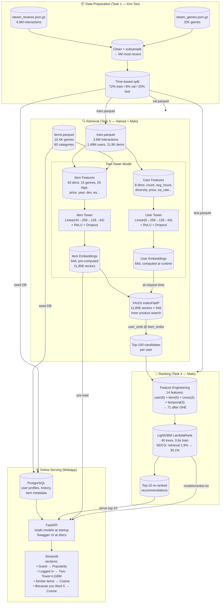
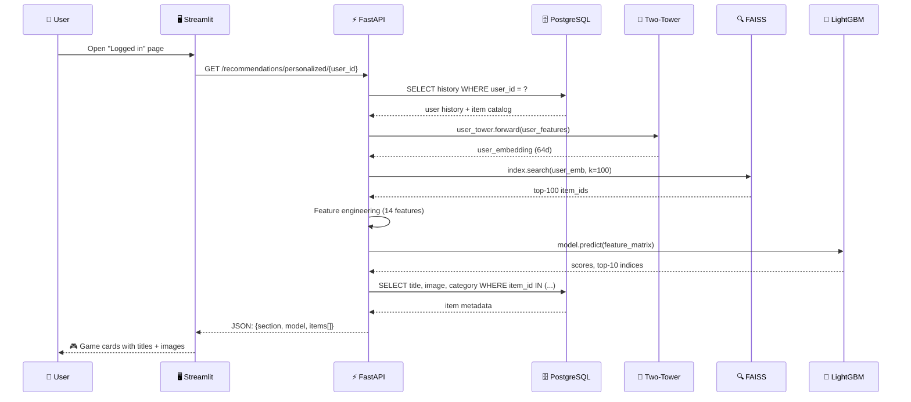

# Complete Pipeline — Steam Recommendation System

## Mermaid: Full Architecture (Offline Training + Online Serving)

## Mermaid: Training Flow (Offline)

```mermaid
flowchart LR
    subgraph STEP1["Step 1: Two-Tower Training"]
        T1[("train.parquet")] --> T2["Build user features (8d)"]
        T1 --> T3["Build item features (43d)"]
        T2 --> T4["Train Two-Tower<br/>30 epochs, GPU<br/>in-batch negatives<br/>softmax cross-entropy"]
        T3 --> T4
        T4 --> T5[("two_tower_enriched.pkl<br/>89 MB")]
    end

    subgraph STEP2["Step 2: FAISS Indexing"]
        T5 --> F1["Extract item_embeddings<br/>(11808, 64)"]
        F1 --> F2["Build IndexFlatIP"]
        F2 --> F3[("FAISS ready")]
    end

    subgraph STEP3["Step 3: Candidate Generation"]
        F3 --> C1["For each val/test user:<br/>compute user_emb → FAISS top-100"]
        C1 --> C2[("retrieval candidates<br/>50K rows, 500 users")]
    end

    subgraph STEP4["Step 4: LightGBM Training"]
        C2 --> L1["14 features → 71 after OHE"]
        L1 --> L2["Train LambdaRank<br/>500 rounds, early stopping"]
        L2 --> L3[("models/ranker.txt<br/>500 KB")]
    end

    T5 --> STEP2
```

## Mermaid: Online Serving Flow (Single Request)

## Key Numbers

| Stage | Metric | Value |
|-------|--------|-------|
| **Data** | Train interactions | 3.6M |
| | Users / Items | 1.49M / 11.8K |
| | Sparsity | 99.98% |
| **Two-Tower** | Item features | 43 (15 genres + 20 tags + 8 stats) |
| | User features | 8 |
| | Embedding dim | 64 |
| | Training time | 411s (GPU) |
| | Recall@20 | 8.0% |
| **FAISS** | Index size | 11,808 vectors |
| | Search time | ~0.3ms |
| **LightGBM** | Features after OHE | 71 |
| | Trees | 40 |
| | Training time | 0.6s |
| | NDCG@10 improvement | 1.9% → 30.1% (+28.2 pts) |
| **Serving** | Total latency | ~10ms |
| | Model size (total) | ~90 MB |
